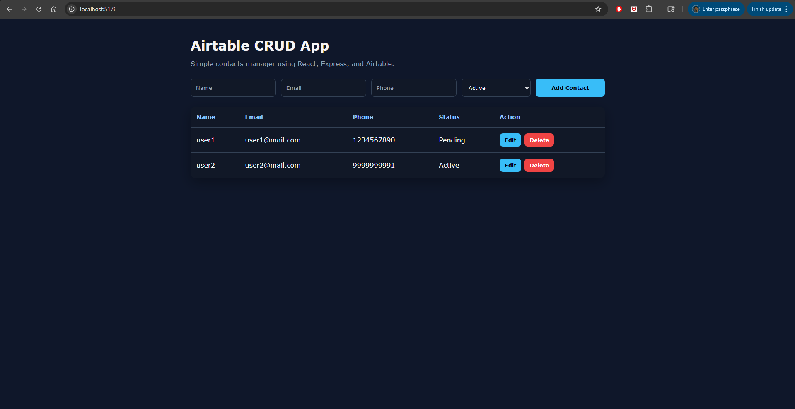

# Airtable API CRUD Demo

Simple full-stack CRUD app using React, Express, and Airtable as the database.



## Features

- Create, Read, Update, Delete records
- Airtable API integration
- Secure backend (API key hidden in .env)

## Tech Stack

- React (Vite)
- Node.js + Express
- Airtable API

## Project Structure

```txt
airtable-api-crud-demo/
├── backend/
└── frontend/
```

## Setup

### Backend

```bash
cd backend
npm install
npm run dev
```

Create a `.env` file inside backend:

```env
PORT=1198
AIRTABLE_TOKEN=your_token
AIRTABLE_BASE_ID=your_base_id
AIRTABLE_TABLE_NAME=Contacts
```

### Frontend

```bash
cd frontend
npm install
npm run dev
```

## Note

Airtable API key is handled securely via backend. Do not expose it in frontend.

## Follow me:

- GitHub: https://github.com/a2rp
- Portfolio: https://www.ashishranjan.net
- LinkedIn: https://www.linkedin.com/in/aashishranjan
- Facebook: https://www.facebook.com/theash.ashish/
- Youtube: https://www.youtube.com/@ashishranjan-ashz
