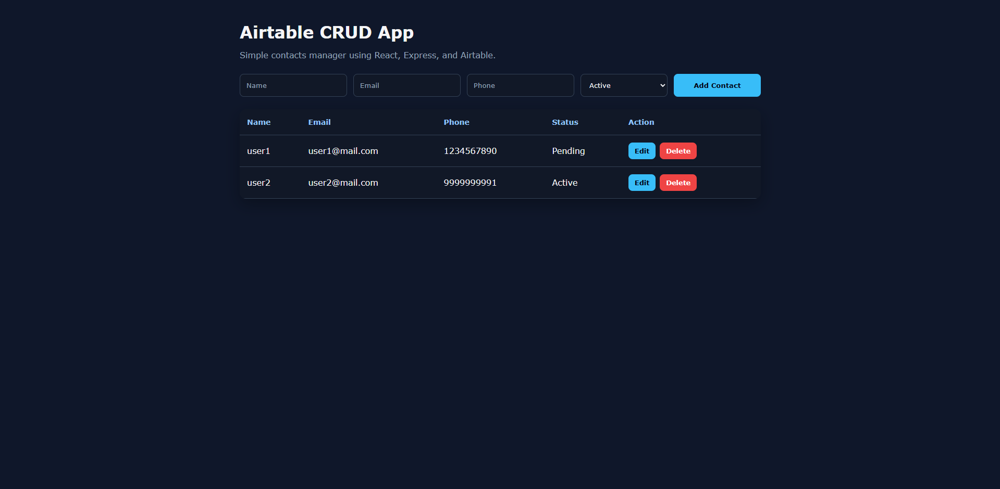

# Airtable API CRUD Demo

A full-stack contact management application built with React, Vite, Node.js, Express.js, and Airtable.

The project demonstrates CRUD operations through a React frontend while keeping Airtable credentials on the backend.



## Features

- View contacts stored in Airtable
- Create contacts
- Update existing contacts
- Delete contacts
- Contact status management
- Loading state while contacts are fetched
- Empty state when no contacts are available
- Delete confirmation
- Airtable REST API integration
- Backend-managed Airtable credentials
- Separate frontend and backend applications

## Contact Fields

The current application works with the following contact fields:

```text
Name
Email
Phone
Status
```

Supported status values in the frontend are:

```text
Active
Pending
Blocked
```

## Tech Stack

### Frontend

- React 18
- React DOM
- Vite
- Axios
- React Icons
- React Router DOM
- styled-components
- Three.js

### Backend

- Node.js
- Express.js
- Axios
- CORS
- dotenv
- Nodemon

### Data Service

- Airtable REST API

## Repository Structure

```text
airtable-api-crud-demo/
├── backend/
│   ├── index.js
│   ├── package.json
│   └── package-lock.json
├── frontend/
│   ├── public/
│   ├── src/
│   ├── package.json
│   └── package-lock.json
├── .gitignore
├── preview.png
├── readme.txt
└── README.md
```

## How It Works

```text
React Frontend
      |
      | HTTP requests
      v
Express Backend
      |
      | Airtable REST API
      v
Airtable
```

The frontend communicates with the Express backend.

The backend reads Airtable configuration from environment variables and sends authenticated requests to the Airtable REST API.

## Backend Configuration

Create a `.env` file inside:

```text
backend/
```

Use:

```env
PORT=1198
AIRTABLE_TOKEN=your_token
AIRTABLE_BASE_ID=your_base_id
AIRTABLE_TABLE_NAME=Contacts
```

The backend reads:

```text
AIRTABLE_TOKEN
AIRTABLE_BASE_ID
AIRTABLE_TABLE_NAME
```

and builds the Airtable API URL dynamically.

Do not expose the Airtable token in frontend code.

## Backend Setup

Move into the backend directory:

```bash
cd backend
```

Install dependencies:

```bash
npm install
```

Start the development server:

```bash
npm run dev
```

The backend development script runs:

```text
nodemon server.js
```

The package also provides:

```bash
npm start
```

which runs:

```text
node server.js
```

> The current repository backend entry file is named `index.js`, while the package scripts currently reference `server.js`. This documentation preserves the repository as-is and does not modify application code.

The configured default backend port is:

```text
1198
```

## Frontend Setup

Move into the frontend directory:

```bash
cd frontend
```

Install dependencies:

```bash
npm install
```

Start the Vite development server:

```bash
npm run dev
```

Create a production build with:

```bash
npm run build
```

Preview the production build with:

```bash
npm run preview
```

## Frontend API URL

The current frontend uses:

```text
http://localhost:1198/api/contacts
```

as its API URL.

## API Reference

Base URL:

```text
http://localhost:1198
```

### Service Root

```http
GET /
```

Current response:

```text
Airtable CRUD API is running
```

### Get All Contacts

```http
GET /api/contacts
```

The backend maps Airtable records into:

```json
{
    "id": "record_id",
    "name": "Contact Name",
    "email": "contact@example.com",
    "phone": "1234567890",
    "status": "Active"
}
```

### Create Contact

```http
POST /api/contacts
Content-Type: application/json
```

Example:

```json
{
    "name": "John Doe",
    "email": "john@example.com",
    "phone": "1234567890",
    "status": "Active"
}
```

Successful creation returns HTTP:

```text
201 Created
```

### Update Contact

```http
PUT /api/contacts/:id
Content-Type: application/json
```

Example:

```json
{
    "name": "John Doe",
    "email": "john@example.com",
    "phone": "9876543210",
    "status": "Pending"
}
```

The Express route receives a `PUT` request and internally sends a `PATCH` request to Airtable for the matching record.

### Delete Contact

```http
DELETE /api/contacts/:id
```

Successful deletion returns:

```json
{
    "message": "Contact deleted successfully"
}
```

## CRUD Flow

```text
Create
  POST /api/contacts

Read
  GET /api/contacts

Update
  PUT /api/contacts/:id

Delete
  DELETE /api/contacts/:id
```

## Airtable Field Mapping

The backend maps application field names to Airtable fields as follows:

```text
name   -> Name
email  -> Email
phone  -> Phone
status -> Status
```

Your Airtable table should therefore use the corresponding field names expected by the current backend implementation.

## Error Responses

The current backend returns HTTP `500` with messages such as:

```json
{
    "message": "Failed to fetch contacts"
}
```

```json
{
    "message": "Failed to create contact"
}
```

```json
{
    "message": "Failed to update contact"
}
```

```json
{
    "message": "Failed to delete contact"
}
```

## Security Note

The Airtable access token is read from the backend environment rather than being stored in frontend source code.

Keep `.env` outside Git and never commit a real Airtable personal access token to a public repository.

## Preview


## Documentation

Detailed project documentation is available in `DOCUMENTATION.md`.

## Author

**Ashish Ranjan**

Full-Stack Web Developer

## Links

- Portfolio: https://www.ashishranjan.net
- GitHub: https://github.com/a2rp
- CodePen: https://codepen.io/ash1198
- LinkedIn: https://www.linkedin.com/in/aashishranjan
- Facebook: https://www.facebook.com/theash.ashish/
- YouTube: https://www.youtube.com/@ashishranjan-ashz?sub_confirmation=1
- Email: mailto:ash.ranjan09@gmail.com

## Support

- Support: https://a2rp-donation-page.netlify.app/
- Buy Me A Coffee: https://buymeacoffee.com/a2rp
- Patreon: https://patreon.com/a2rp

## License

This project is licensed under the MIT License.
